# Route Diagram - SPK Calon Pegawai

## Overview

Aplikasi SPK Calon Pegawai menggunakan metode TOPSIS untuk seleksi kandidat. Berikut adalah diagram rute lengkap aplikasi.

## Route Structure

```mermaid
graph TD
    A[Root /] --> B[Login Page]
    B --> C[Dashboard]

    C --> D[Profile Management]
    C --> E[Master Data]
    C --> F[Penilaian]
    C --> G[Perhitungan TOPSIS]

    D --> D1[Edit Profile]
    D --> D2[Update Profile]
    D --> D3[Delete Account]

    E --> E1[Kriteria]
    E --> E2[Sub Kriteria]
    E --> E3[Objek/Calon Pegawai]
    E --> E4[Alternatif]

    E1 --> E1A[Index Kriteria]
    E1 --> E1B[Simpan Kriteria]
    E1 --> E1C[Ubah Kriteria]
    E1 --> E1D[Update Kriteria]
    E1 --> E1E[Hapus Kriteria]

    E2 --> E2A[Index Sub Kriteria]
    E2 --> E2B[Simpan Sub Kriteria]
    E2 --> E2C[Ubah Sub Kriteria]
    E2 --> E2D[Update Sub Kriteria]
    E2 --> E2E[Hapus Sub Kriteria]

    E3 --> E3A[Index Objek]
    E3 --> E3B[Simpan Objek]
    E3 --> E3C[Ubah Objek]
    E3 --> E3D[Update Objek]
    E3 --> E3E[Hapus Objek]
    E3 --> E3F[Import CSV]
    E3 --> E3G[Download Template]

    E4 --> E4A[Index Alternatif]
    E4 --> E4B[Simpan Alternatif]
    E4 --> E4C[Hapus Alternatif]

    F --> F1[Index Penilaian]
    F --> F2[Simpan Penilaian]
    F --> F3[Ubah Penilaian]
    F --> F4[Update Penilaian]
    F --> F5[Hapus Penilaian]
    F --> F6[Export PDF]

    G --> G1[Perhitungan Index]
    G --> G2[Hitung TOPSIS]
    G --> G3[Hasil Akhir]
    G --> G4[Export PDF TOPSIS]
    G --> G5[Export PDF Hasil]
```

## Route Details

### Authentication Routes

-   `GET /` → Login page
-   `GET /profile` → Edit profile (auth)
-   `PATCH /profile` → Update profile (auth)
-   `DELETE /profile` → Delete account (auth)

### Dashboard Routes (Prefix: `/dashboard`)

**Base:**

-   `GET /dashboard` → Dashboard index

**Kriteria Management (Prefix: `/dashboard/kriteria`):**

-   `GET /dashboard/kriteria` → Index kriteria
-   `POST /dashboard/kriteria/simpan` → Simpan kriteria
-   `GET /dashboard/kriteria/ubah` → Ubah kriteria (form)
-   `POST /dashboard/kriteria/ubah` → Update kriteria
-   `POST /dashboard/kriteria/hapus` → Hapus kriteria

**Sub Kriteria Management (Prefix: `/dashboard/sub_kriteria`):**

-   `GET /dashboard/sub_kriteria` → Index sub kriteria
-   `POST /dashboard/sub_kriteria/simpan` → Simpan sub kriteria
-   `GET /dashboard/sub_kriteria/ubah` → Ubah sub kriteria (form)
-   `POST /dashboard/sub_kriteria/ubah` → Update sub kriteria
-   `POST /dashboard/sub_kriteria/hapus` → Hapus sub kriteria

**Objek/Calon Pegawai Management (Prefix: `/dashboard/objek`):**

-   `GET /dashboard/objek` → Index objek (calon pegawai)
-   `POST /dashboard/objek/simpan` → Simpan objek
-   `GET /dashboard/objek/ubah` → Ubah objek (form)
-   `POST /dashboard/objek/ubah` → Update objek
-   `POST /dashboard/objek/hapus` → Hapus objek
-   `POST /dashboard/objek/import` → Import CSV objek
-   `GET /dashboard/objek/template` → Download template CSV

**Alternatif Management (Prefix: `/dashboard/alternatif`):**

-   `GET /dashboard/alternatif` → Index alternatif
-   `POST /dashboard/alternatif/simpan` → Simpan alternatif
-   `POST /dashboard/alternatif/hapus` → Hapus alternatif

**Penilaian Management (Prefix: `/dashboard/penilaian`):**

-   `GET /dashboard/penilaian` → Index penilaian
-   `POST /dashboard/penilaian/simpan` → Simpan penilaian
-   `GET /dashboard/penilaian/ubah/{alternatif_id}` → Ubah penilaian (form)
-   `POST /dashboard/penilaian/ubah/{alternatif_id}` → Update penilaian
-   `POST /dashboard/penilaian/hapus` → Hapus penilaian
-   `POST /dashboard/penilaian/export-pdf` → Export penilaian ke PDF

**TOPSIS Calculation Routes:**

-   `GET /dashboard/perhitungan` → Index perhitungan TOPSIS
-   `POST /dashboard/hitung_topsis` → Proses perhitungan TOPSIS
-   `GET /dashboard/hasil_akhir` → Hasil akhir perhitungan
-   `POST /dashboard/pdf_topsis` → Export PDF perhitungan TOPSIS
-   `POST /dashboard/pdf_hasil` → Export PDF hasil akhir

## Navigation Flow

### User Flow

1. **Login** → Dashboard
2. **Dashboard** →
    - Master Data Management
    - Penilaian Management
    - Perhitungan TOPSIS
    - Profile Management

### Data Entry Flow

1. **Kriteria** → **Sub Kriteria** → **Objek (Calon Pegawai)** → **Alternatif** → **Penilaian**
2. **Import CSV** untuk Objek (Calon Pegawai)

### Calculation Flow

1. **Penilaian** → **Perhitungan TOPSIS** → **Hasil Akhir**
2. Export PDF untuk dokumentasi

## Middleware

-   **Authentication**: Semua routes kecuali `/` (login) memerlukan auth middleware
-   **Prefix**: Dashboard routes menggunakan prefix `/dashboard`

## Controllers

-   `DashboardController` → Dashboard utama
-   `KriteriaController` → Management kriteria
-   `SubKriteriaController` → Management sub kriteria
-   `ObjekController` → Management calon pegawai + import CSV
-   `AlternatifController` → Management alternatif
-   `PenilaianController` → Management penilaian + export PDF
-   `TopsisController` → Perhitungan TOPSIS + export PDF
-   `ProfileController` → Management profile user
